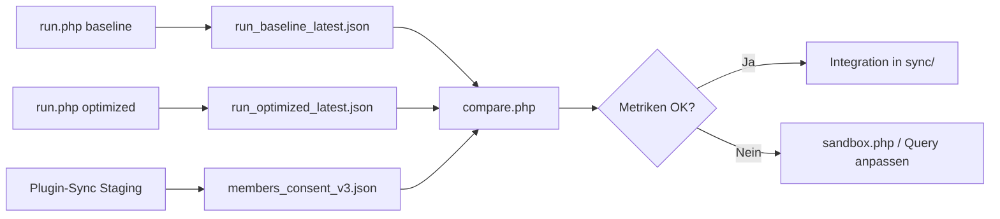

# BSEasy Sync-Lab

Isoliertes CLI-Labor zum Testen von Sync-Strategien **ohne** den Produktions-Sync-Code zu ändern.

## Sicherheit / Isolation

| Aspekt | Verhalten |
|--------|-----------|
| Plugin-Bootstrap | **Lädt sync-lab nicht** — kein Eintrag in `bootstrap/load.php` |
| Schreibziel | Nur `dev/sync-lab/output/` |
| Produktions-JSON | `uploads/bseasy-sync/v3/members_consent_v3.json` wird **nur gelesen** (compare) |
| WordPress-Optionen | Mit `--wp` werden Token/Consent-ID **gelesen**, Sync-Lab schreibt keine WP-Optionen |
| Plugin-Sync im Admin | **Unverändert** — parallel nutzbar, aber nicht gleichzeitig gegen API voll lasten |

## Voraussetzungen

- PHP CLI mit `curl`-Erweiterung (PHP 7.4+)
- EasyVerein API Bearer-Token
- Optional: WordPress-Installation mit aktivem BSEasy Sync V4

## Einrichtung

```bash
cd bseasy-sync-v4/dev/sync-lab
cp .env.example .env
# EASYVEREIN_TOKEN=... eintragen
```

Alternativ Token aus WordPress (empfohlen auf Staging):

```bash
# Token wird automatisch entschlüsselt (bes_decrypt_token)
php run.php --wp=/pfad/zu/wordpress/wp-load.php --strategy=baseline --limit=5
```

## Befehle

### 1. Sync-Lauf (Strategie testen)

```bash
# Baseline — nachbildet aktuelles Request-Muster (~3–4 Calls/Member)
php run.php --wp=/pfad/wp-load.php --strategy=baseline --limit=20

# Optimized — nested query, Ziel ~1 Call/Member
php run.php --wp=/pfad/wp-load.php --strategy=optimized --limit=20

# Feste IDs (apples-to-apples Vergleich)
php run.php --strategy=baseline --ids=12345,67890 --token=DEIN_TOKEN
php run.php --strategy=optimized --ids=12345,67890 --token=DEIN_TOKEN
```

Output: `output/run_<strategie>_latest.json` + Metriken in der Konsole.

### 2. API-Sandbox (Experimente E1–E4)

```bash
php sandbox.php --wp=/pfad/wp-load.php --experiment=all
php sandbox.php --wp=/pfad/wp-load.php --experiment=e2   # nested query
php sandbox.php --wp=/pfad/wp-load.php --experiment=e3   # select-options
```

### 3. Vergleich mit Produktions-JSON

Nach einem Plugin-Sync (oder bestehender JSON):

```bash
php compare.php --strategy=baseline
php compare.php --strategy=optimized --verbose
php compare.php --against=/pfad/uploads/bseasy-sync/v3/members_consent_v3.json
```

Report: `output/compare_<strategie>_latest.json`

## Typischer Testablauf



### Schritt für Schritt

1. **Baseline im Plugin** (Admin → Sync) für Referenz-JSON — oder bestehende Datei nutzen.
2. **Gleiche Member-IDs im Lab:**
   ```bash
   php run.php --wp=... --strategy=baseline --limit=20 --offset=0
   php run.php --wp=... --strategy=optimized --limit=20 --offset=0
   ```
3. **Metriken vergleichen:** `request_count`, `requests_per_member`, `duration_sec`, `http_429_count`.
4. **Datenqualität:** `compare.php` — gemeinsame IDs, Wert-Abweichungen.
5. **Entscheidung:** Wenn optimized ≥40 % weniger Requests bei vergleichbarer Datenqualität → Integration planen.

## Erfolgskriterien (Richtwerte)

| Kriterium | Ziel |
|-----------|------|
| Requests/Member (optimized) | ≤ 2 (ideal: 1) vs. baseline ~3–4 |
| HTTP 429 | nicht höher als baseline |
| compare: gemeinsame IDs | Lab-Subset ⊆ Referenz (bei gleichem offset/limit) |
| Wert-Diffs | akzeptabel (Lab extrahiert vereinfachtes Schema) |

**Hinweis:** Das Lab erzeugt ein **vereinfachtes** Member-Schema (`id`, `contact`, `custom_fields`, `_lab`). Ein 1:1-Vergleich aller Plugin-Felder ist erst nach Integration möglich. Der Vergleich prüft vor allem **Überlappung und Kernfelder**.

## Strategien

| Name | Beschreibung |
|------|--------------|
| `baseline` | Wie V4: Member `{*}`, CF-Liste, Contact `{*}`, Contact-CF |
| `optimized` | Ein nested Query auf Member-Detail; Fallback auf baseline |
| `sandbox` | API-Experimente E1–E4 (Pagination, nested, select-options, consent-filter) |

## Testing im Plugin vs. im Lab

| | **Sync-Lab (CLI)** | **Plugin (Admin-Sync)** |
|--|-------------------|-------------------------|
| Zweck | Strategien messen, API erforschen | Produktions-Sync, Frontend-Daten |
| Output | `dev/sync-lab/output/*.json` | `uploads/bseasy-sync/v3/members_consent_v3.json` |
| Frontend | **Kein Effekt** | Shortcodes/Karte nutzen diese JSON |
| Risiko | Keins für Live-Site | Normal (Staging zuerst) |
| Wann | Vor jeder Sync-Architektur-Änderung | Regelmäßiger Datenabgleich |

**Empfehlung:** Lab auf Staging mit `--wp` und kleinem `--limit`. Plugin-Sync nur für Referenz-JSON oder nach erfolgreicher Lab-Entscheidung.

## Dateistruktur

```
dev/sync-lab/
├── run.php              # Haupt-CLI
├── compare.php          # Lab vs. Produktion
├── sandbox.php          # API-Experimente
├── bootstrap.php        # Autoload (nicht Plugin!)
├── config.php
├── lib/                 # ApiClient, Metrics, …
├── strategies/          # baseline, optimized, sandbox
└── output/              # gitignored
```

## Integration (später, manuell)

Erst wenn Lab-Metriken überzeugen:

1. Lab-Logik nach `sync/client/` oder neue `sync/strategies/`
2. Schalter in `sync-service.php` (Feature-Flag)
3. Staging-Vollsync → Produktion

Bis dahin: **keine Änderungen** an `sync/api-core-consent-v3.php` o.ä.
